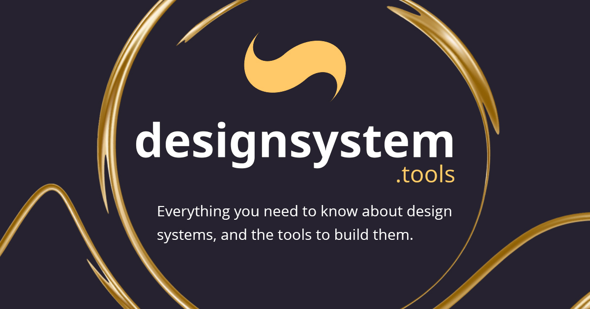

<p><a href="https://designsystem.tools" target="_blank" rel="noreferrer" title="designsystem.tools"></a></p>

# designsystem.tools

This resource is maintained to help explain what design systems are, what value they provide, and the features that can compose one.

Feel free to make suggestions, create a pr, or reach out to me on Twitter [@kolbysisk](https://twitter.com/KolbySisk).

## Development

### Stack

- [Next.js](https://nextjs.org/) (w/ TypeScript)
- [Tailwindcss](https://tailwindcss.com/)
- [Headless-ui](https://headlessui.dev/)
- [usehooks-ts](https://usehooks-ts.com/)
- Hosted on [Vercel](vercel.com/)

### Running locally

```
npm i
npm run dev
```
